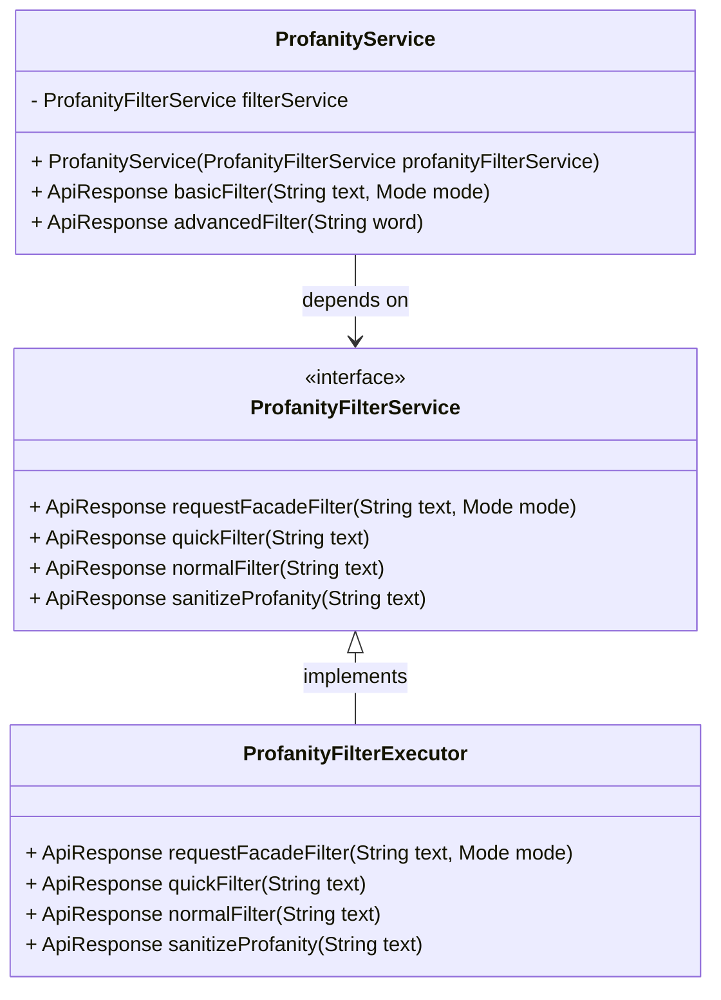

### 개발 진행중인 프로젝트입니다 문의사항은 Issue로 등록하거나 이메일로 문의바랍니다.

# profanity-filter-api

한국어와 영어 비속어를 모두 검증할 수 있는 서비스입니다.

운영은 제 개인 서버의 전기가 끊이지 않는 한 계속될 예정입니다.

만약 실제 운영 서비스에 사용할 목적이면서 비용에 대한 부담이 가능한 경우 [KISO 이용자 보호 시스템 API 서비스](https://www.safekiso.com/)를 사용해보세요.

월 7만원 가량의 비용으로 매우 높은 신뢰성을 가진 검증이 가능합니다.

다만 우리는 돈이 없지만 욕설은 막고 싶으니 제가 무료 서비스를 제공해보도록 하겠습니다.

----

## 소개

### Basic 모델

- 정규식과 비속어 데이터베이스를 이용한 경량형 비속어 필터링 모델입니다.
- 문장의 경우 비속어의 갯수가 아닌 포함 여부만 판단합니다.
- 비속어 검사의 경우 아호코라식 알고리즘을 사용하여 빠르게 검사합니다.
- 원색적인 욕설의 경우 대부분 필터링이 가능합니다.
- 부정적인 문장 , 비꼬는 문장의 경우까지 필터링이 필요한 경우 Advanced 모델을 사용해주세요.

### Advanced 모델

- 구현 예정인 정밀 필터링 모델입니다.
- 인증되지 않은 사용자의 경우 1일 10회 사용 제한이 있습니다.

### 사용 예시

**비속어 검증 요청하기**:

- 요청 URL: `POST https://api.profanity-filter.run/api/v1/filter/basic`
- 필요 파라미터:
    - `word`: 검증할 문장 (예: "나쁜말")
- 사용 예 (cURL):
  ```bash
  curl -X POST "https://api.profanity-filter.run/api/v1/filter/basic" \
    -H "accept: application/json" \
    -H "Content-Type: application/json" \
    -d '{"word": "나쁜말"}'
  ```

- 응답 예:
  ```json
  {
   "status": "OK",
   "message": "비속어가 존재하지 않습니다.",
   "isProfane": false
  }
  ```

### 주의사항

- 이 서비스는 포트폴리오나 비영리 서비스를 할때 최소한의 금액이라도 절약하기 바라는 마음으로 제작되었습니다.
- 따라서 영리 목적으로 사용할 경우에는 [KISO 이용자 보호 시스템 API 서비스](https://www.safekiso.com/)를 사용하세요.
- 이 서비스는 무료로 제공되는 서비스이므로, 제 서버컴퓨터가 불의의 사고 등으로 다운되는 경우가 있을 수 있습니다. 이 점 유의해주세요.
- API 스펙은 변경될 수 있습니다. 변경 시에는 문서를 통해 공지하겠습니다. 추구하고자 하는 모델은 [KISO 이용자 보호 시스템 API 서비스](https://www.safekiso.com/) 입니다.

> 추가적인 문의 사항은 rlagusrl928@gmail.com으로 연락 혹은 issue를 등록해주세요.



