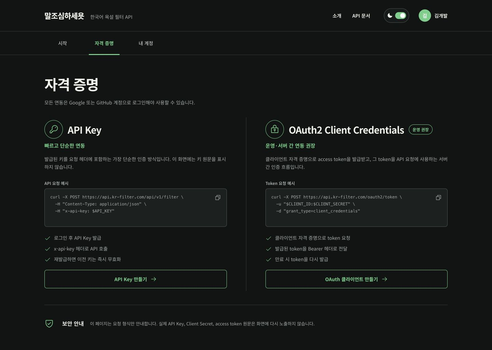
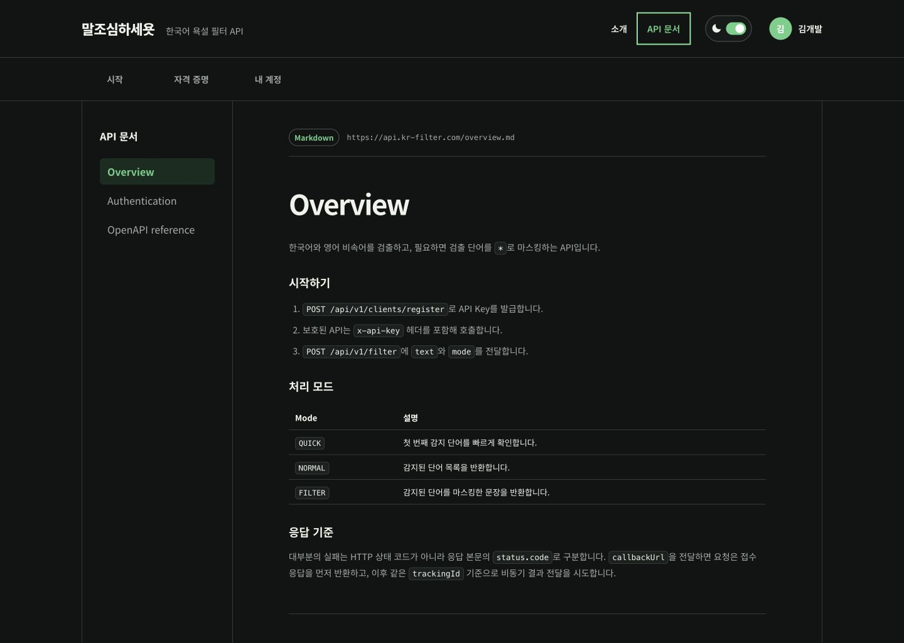
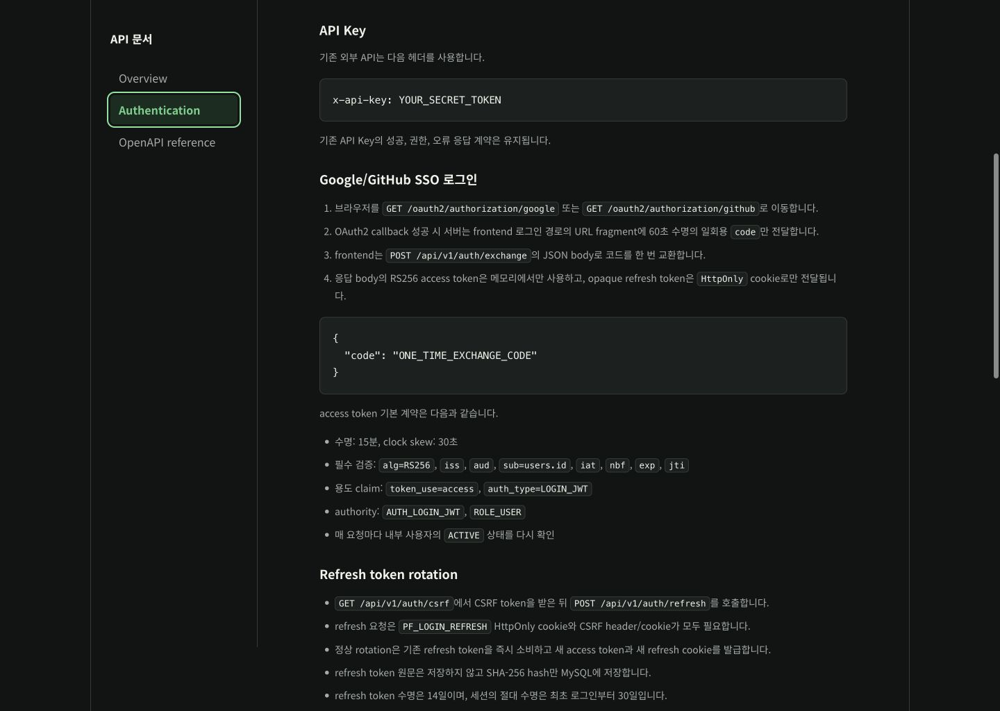
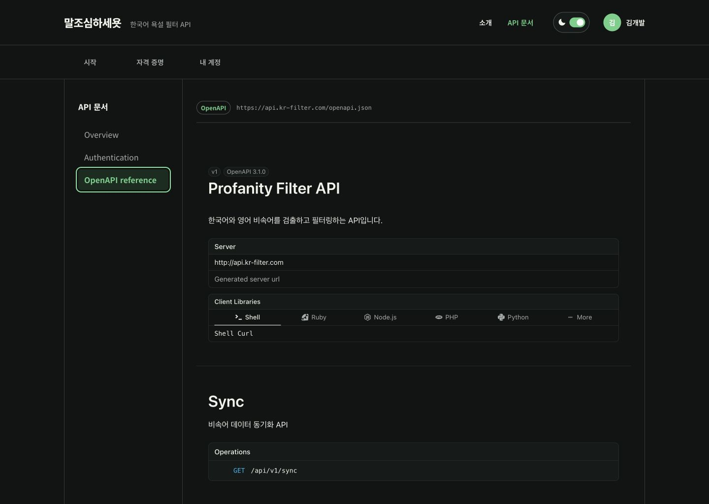
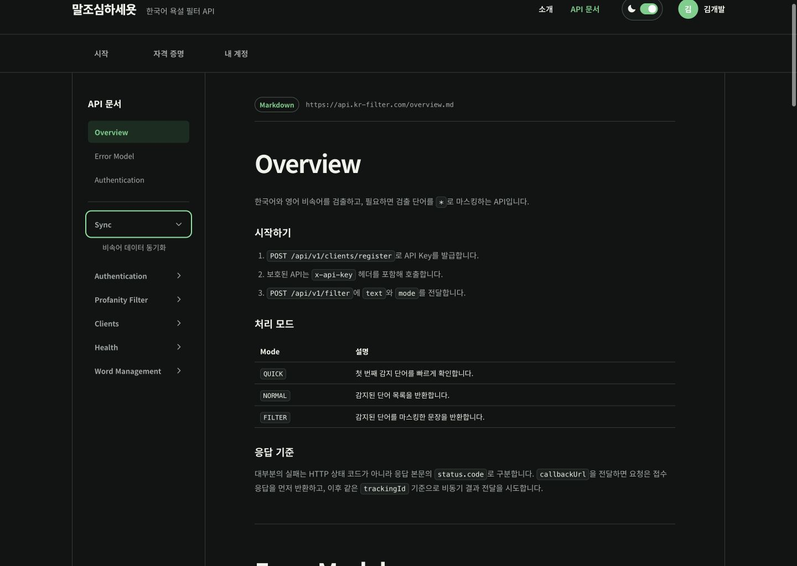

# Product Flow Audit

## Verdict

The credentials and documentation flows are healthy after the revision. The prior credentials screen exposed too little of the real authentication flow, and the documentation renderer broke fenced code and delayed the first useful paint despite fast upstream APIs. Both issues are resolved in the accepted screenshots below.

## Steps

### 1. Credentials comparison — healthy

- Strength: API Key and OAuth2 now use the same seven-row visual rhythm, and both actions share the same baseline.
- Strength: examples use environment-variable placeholders and never render a real credential value.
- Strength: `OAuth2 Client Credentials` remains on one line at desktop and mobile widths.
- Accessibility: copy actions retain descriptive labels, the two methods are semantic articles, and mobile has no horizontal overflow.

### 2. Overview documentation — healthy

- Strength: Markdown tables, ordered lists, inline code and fenced code are rendered as their proper elements.
- Strength: document requests start when the application loads and are reused from a module cache when the user enters `/docs`.
- Accessibility: tables retain table semantics and code samples scroll horizontally instead of clipping the page.

### 3. Authentication JSON example — healthy

- Strength: the JSON fence is removed from visible content and the example is grouped into one readable code block.
- Strength: the code block preserves whitespace without causing page-level overflow.

### 4. OpenAPI reference — healthy

- Strength: the custom flat operation list is replaced by Scalar, restoring grouped operations, server information and client examples.
- Strength: Scalar inherits the product theme and typography tokens while keeping its native API-reference hierarchy.

### 5. Documentation sidebar tree — healthy

- Strength: `Overview`, `Error Model`, and `Authentication` are generated from the live Markdown's level-one headings and link to matching document anchors.
- Strength: a divider separates the Markdown navigation from the six OpenAPI tag groups.
- Strength: API groups are collapsed by default; expanding a group reveals operation summaries, and selecting a summary opens the matching Scalar operation anchor.
- Accessibility: group controls expose `aria-expanded` and `aria-controls`, while selected document and operation links expose `aria-current`.

## Evidence limits

- Screenshots and browser inspection verify visible layout, semantics, loading behavior and console output; they do not establish full WCAG compliance.
- The remote Overview currently describes OAuth2 Client Credentials as unimplemented. The credentials screen presents the user-requested future request shape, so server documentation must be updated when that API ships.
